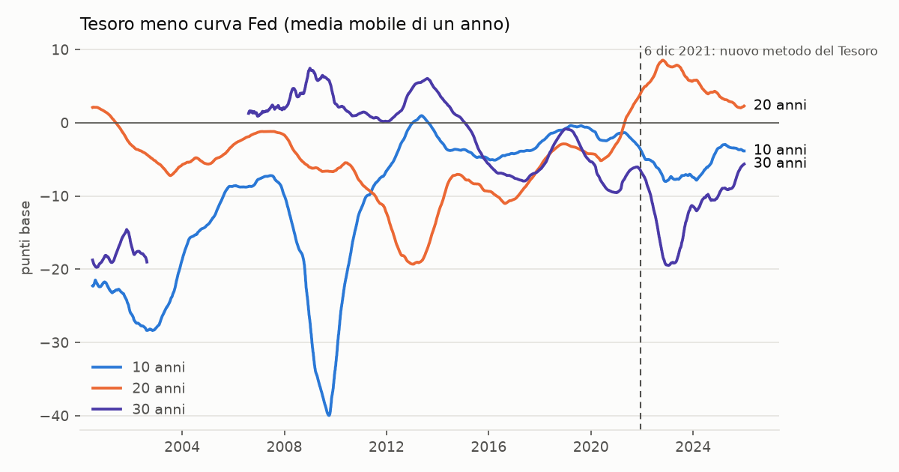
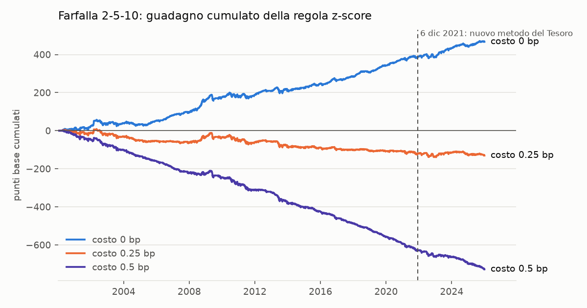

# yield-curve-relative-value

Calibrazione e validazione del modello di Nelson-Siegel sulla curva dei Treasury USA, e verifica di una strategia di valore relativo (statistico) sulla curva. Non la chiamo arbitraggio: non c'e' nessun guadagno privo di rischio, solo una scommessa sul ritorno alla media di scostamenti dalla curva.

La domanda a cui voglio rispondere e': quando un punto della curva sta sopra o sotto il modello, che cosa significa quello scostamento (il residuo)? Puo' essere errore del modello, un premio noto del mercato, o un segnale che rientra e su cui si puo' guadagnare. E dopo i costi resta qualcosa? Ho scritto questo progetto per dare una risposta quantitativa, anche se negativa.

## Indice

1. [Risultato in breve](#1-risultato-in-breve)
2. [Come e' fatto il progetto](#2-come-e-fatto-il-progetto)
3. [Convenzioni](#3-convenzioni)
4. [Dati e fonti](#4-dati-e-fonti)
5. [Matematica di un titolo](#5-matematica-di-un-titolo)
6. [La curva e il controllo contro la Fed](#6-la-curva-e-il-controllo-contro-la-fed)
7. [Mondo sintetico](#7-mondo-sintetico)
8. [Dati reali](#8-dati-reali)
9. [Strategia](#9-strategia)
10. [La curva di oggi](#10-la-curva-di-oggi)
11. [Limiti](#11-limiti)
12. [Come riprodurre](#12-come-riprodurre)
13. [Bibliografia](#13-bibliografia)

## 1. Risultato in breve

- Le mie formule di Nelson-Siegel/Svensson riproducono zero, forward e par yield pubblicati dalla Fed con uno scarto massimo di 0.00005 punti percentuali, cioe' l'arrotondamento dei dati.
- I punti del Tesoro hanno rendimenti piu' bassi della curva Fed: i titoli appena emessi sono piu' cari. Il premio e' statisticamente netto, cambia nel tempo e a 10 anni vale in media -10 bp (sezione 8).
- Il residuo di Nelson-Siegel sui punti del Tesoro e' di 2.5-3.6 bp fino a 7 anni e 6-9 bp a 10-30 anni, ed e' molto persistente (autocorrelazione a un giorno 0.91-0.99): e' in gran parte errore di forma del modello, non mispricing che rientra.
- Una regola di ritorno alla media sui residui e sulle farfalle guadagna al lordo, ma il guadagno si azzera con un costo di circa 0.2 bp per unita' di DV01 su ogni gamba. Con costo 0.25 bp sette strategie su otto sono negative. Non ho trovato un vantaggio eseguibile.





## 2. Come e' fatto il progetto

```
src/yield_curve_relative_value/
    obbligazioni.py     prezzo, rateo, rendimento, duration, DV01, convessita'
    curva.py            Nelson-Siegel / Svensson, par yield, calibrazione
    mondo_sintetico.py  curva nota con mispricing e rumore noti
    dati.py             lettura, download (con robots.txt) e storico
    analisi.py          premio del titolo nuovo, fit giornaliero, PCA, previsione
    strategia.py        z-score, farfalle, guadagni
    corrente.py         confronto della curva piu' recente con lo storico
    statistica.py       Newey-West
    grafici.py          i due grafici
scripts/                un script per ogni sezione dei risultati
tests/                  78 test; i test lenti sono marcati "slow"
data/storico/           curve del Tesoro e della Fed dal 2000 al 2025 (CSV piccoli, versionati)
data/corrente/          dati recenti scaricati a ogni esecuzione (non versionata)
notebooks/analisi.ipynb notebook eseguito, con gli output salvati
img/                    i grafici di questo README
```

Ogni numero di questo README viene da uno script (tabella a fine sezione 12). I nomi dei moduli sono in italiano; le formule sono scritte nelle docstring, e i test controllano che codice e docstring concordino.

## 3. Convenzioni

Le convenzioni sono dichiarate nel codice e verificate dai test, perche' sbagliarle da' errori che sembrano risultati.

| Cosa | Convenzione |
|---|---|
| Rendimenti | percentuale annua (4.5 = 4,5%) |
| Differenze | punti base (bp) |
| Cedole dei titoli | semestrali; date generate all'indietro dalla scadenza; scadenza a fine mese implica cedole a fine mese |
| Rateo | ACT/ACT: giorni trascorsi sul periodo cedolare |
| Rendimento di un titolo | stile "Street": primo periodo frazionario, poi sconto con (1 + y/2) per periodo |
| Tassi zero (curva Fed, mia curva) | capitalizzazione continua |
| Par yield | rendimento della cedola semestrale che fa valere il titolo 100: c = 200 (1 - P(T)) / somma P(t_i), t_i = 0.5, 1, ..., T |
| Tempo dei flussi nella curva | giorni reali / 365.25 |
| Punti del Tesoro | par yield: la curva si adatta in modo che i suoi par yield riproducano quelli osservati |

Lo zero continuo e il par yield sono due cose diverse e la Fed li pubblica in colonne separate (SVENY e SVENPY): confonderli e' la prima trappola. Il prezzo di un titolo a cedola uguale al par yield viene 100.004 e non 100, perche' il par yield usa mezzi anni esatti e il prezzo i giorni reali; lo scarto e' documentato in un test.

## 4. Dati e fonti

Uso solo dati gratuiti.

| Fonte | Cosa | Uso |
|---|---|---|
| Tesoro USA, punti a scadenza costante | par yield giornalieri a 1, 2, 3, 5, 7, 10, 20, 30 anni, dal 2000 | dato principale |
| Fed, curva di Gurkaynak-Sack-Wright | parametri e curve di Svensson stimati su singoli titoli, dal 1961 | riferimento esterno |

Perche' queste: il Tesoro pubblica solo punti interpolati (nessun prezzo di singolo titolo), e la Fed e' l'unico riferimento stimato su singoli titoli che sia gratuito e documentato. Non esistono prezzi giornalieri gratuiti per singolo titolo, quindi non faccio un backtest a livello di obbligazione.

Cose da sapere:

- Il Tesoro costruisce i punti con i soli titoli appena emessi (bills, note 2-3-5-7-10 anni, bond 20 e 30 anni), con quotazioni indicative delle 15:30. Dal 6 dicembre 2021 usa il metodo monotone convex, prima uno spline quasi-cubico: e' una rottura strutturale, quindi leggo sempre due periodi.
- La curva Fed esclude bills, titoli sotto 3 mesi, callable, il titolo nuovo e il primo vecchio. Gli autori avvertono che i parametri saltano da un giorno all'altro: confronto curve, mai parametri.
- I 30 anni mancano dal 2002 al 2006 (non erano emessi); i flussi di quei giorni usano le altre scadenze.
- Prima di ogni download leggo il robots.txt dell'host: 404 vuol dire nessuna regola, 401 o 403 vietato. Una richiesta al secondo.
- Ho scartato FedInvest (TreasuryDirect): i prezzi sono valutazioni amministrative per titoli speciali, tutte multiple di 1/32 (risoluzione 0.4-1.6 bp), e il sito vieta robot e ridistribuzione. I termini d'uso delle altre fonti li ho letti ma non sono un legale: chi riusa i dati controlli le condizioni.

## 5. Matematica di un titolo

`obbligazioni.py`: prezzo sporco dato il rendimento, rateo, prezzo pulito, rendimento dal prezzo (Brent), duration di Macaulay e modificata, DV01 (variazione del prezzo per 100 per +1 bp) e convessita'. Controllo con formule chiuse (titolo alla pari su data cedola, rendita, zero coupon) e con differenze finite per DV01 e convessita'.

## 6. La curva e il controllo contro la Fed

`curva.py`: zero, fattore di sconto, forward istantaneo, par yield e carichi dei tre fattori. Formula di Svensson (Nelson-Siegel e' il caso beta3 = 0):

y(n) = b0 + b1 A(n/t1) + b2 [A(n/t1) - exp(-n/t1)] + b3 [A(n/t2) - exp(-n/t2)], con A(x) = (1 - exp(-x)) / x.

Calibrazione: sui prezzi, con pesi 1/duration (come Gurkaynak, Sack e Wright) e tau libero o fisso (Diebold-Li, lambda fisso a 1.37 anni); sui par yield osservati, con piu' punti di partenza perche' la stima non lineare ha minimi locali (ripartire dalla soluzione del giorno prima peggiorava i residui).

Controllo: con i parametri della Fed su 40 date dal 1971 al 2026 (file `tests/dati/gsw_campione.csv`) ricalcolo zero, forward e par yield e li confronto con le colonne pubblicate. Scarto massimo 0.00005 punti percentuali per tutte e tre. Diagnostica di identificabilita': `condizionamento` misura la collinearita' dei carichi.

## 7. Mondo sintetico

Prima dei dati veri: una curva Nelson-Siegel nota con fattori AR(1), a cui sommo un mispricing OU (mean-reverting, dev. std ed emivita note) e un rumore di misura. Qui so qual e' la risposta giusta.

Le impostazioni sono fisse: 1500 giorni, emivita 5 giorni, rumore 0.5 bp, 60 simulazioni per cella, soglia t di Newey-West 2 (10 ritardi). Il rumore e' errore di misura: disturba il segnale ma i guadagni si calcolano sui prezzi senza rumore, altrimenti ogni rumore indipendente darebbe un guadagno fasullo perche' rientra da solo.

Recupero con rumore (media di 60 simulazioni, errore quadratico medio):

| tau | beta0 | beta1 | beta2 | tau | curva (bp) |
|---|---|---|---|---|---|
| libero | 0.012 | 0.027 | 0.411 | 0.648 | 0.363 |
| fisso = vero (2.0) | 0.005 | 0.009 | 0.027 | 0.000 | 0.306 |
| fisso Diebold-Li (1.37) | 0.057 | 0.302 | 0.910 | 0.630 | 2.331 |

I parametri si stimano male (beta2 e tau soprattutto) ma la curva e' precisa: e' lo stesso sintomo visto nei parametri della Fed. Un lambda fisso sbagliato costa 2.3 bp di curva.

Falsi positivi (nessun mispricing, guadagni sui prezzi senza rumore):

| curva vera | fit | costo (bp) | frequenza t > 2 | guadagno medio (bp/giorno) |
|---|---|---|---|---|
| Nelson-Siegel | tau libero | 0 | 0.983 | 0.0114 |
| Nelson-Siegel | tau libero | 0.25 | 0.000 | -0.1185 |
| Nelson-Siegel | tau fisso | 0 | 0.017 | -0.0003 |
| Svensson | tau libero | 0 | 1.000 | 0.0778 |
| Svensson | tau libero | 0.25 | 0.000 | -0.0212 |
| Svensson | tau fisso | 0 | 0.117 | 0.0027 |

Stimare il tau ogni giorno sugli stessi dati crea un guadagno lordo minuscolo ma "significativo" quasi sempre; con tau fisso i falsi positivi tornano al livello atteso. Se la curva vera ha una seconda gobba che Nelson-Siegel non descrive, il guadagno lordo apparente sale. In tutti i casi sparisce con un costo di 0.25 bp.

Mispricing minimo rilevabile (potere almeno 0.8), dev. std in bp: **0.5** senza costi, **1.75** con costo 0.25 bp, **4.0** con costo 0.5 bp. Se i residui reali fossero piu' piccoli di un paio di bp, nessuna strategia sarebbe distinguibile dal rumore.

## 8. Dati reali

Premio del titolo nuovo: Tesoro meno curva Fed, per scadenza e periodo (media, deviazione standard in bp; t di Newey-West con 20 ritardi, perche' le serie hanno autocorrelazione vicina a 1). I p-value non sono corretti per test multipli.

| scadenza | fino a dic 2021: media | dev. std | t | da dic 2021: media | dev. std | t |
|---|---|---|---|---|---|---|
| 1 | -3.62 | 7.25 | -8.64 | -1.71 | 4.98 | -2.95 |
| 2 | -0.83 | 3.62 | -4.00 | -3.53 | 2.74 | -11.44 |
| 3 | -1.82 | 4.11 | -7.62 | -2.89 | 2.28 | -10.79 |
| 5 | -1.95 | 3.32 | -10.20 | -2.46 | 1.61 | -12.63 |
| 7 | -2.60 | 6.30 | -6.85 | 0.22 | 1.80 | 1.09 |
| 10 | -10.86 | 11.00 | -16.11 | -5.66 | 3.01 | -14.77 |
| 20 | -5.87 | 5.32 | -18.07 | 4.99 | 3.05 | 12.27 |
| 30 | -3.10 | 7.79 | -5.99 | -11.59 | 6.29 | -13.48 |

Il segno medio e' negativo (titolo nuovo piu' caro), massimo a 10 anni. A 20 anni cambia segno dopo il 2021 e a 30 anni il premio si allarga: non ho una spiegazione verificata. Possono contribuire il metodo del Tesoro, l'orario (15:30 contro fine giornata) e la selezione dei titoli nella curva Fed. Il confronto di fondo e' tra due stime diverse della stessa curva, quindi una parte del premio e' differenza di metodo e non premio di mercato.

Nelson-Siegel sui punti del Tesoro (par yield, adattamento giornaliero, tau tra 0.3 e 10 anni). Scarto quadratico medio del residuo in bp:

| periodo | 1 | 2 | 3 | 5 | 7 | 10 | 20 | 30 |
|---|---|---|---|---|---|---|---|---|
| fino a dic 2021 | 2.54 | 3.19 | 2.48 | 3.04 | 3.79 | 5.61 | 8.12 | 6.31 |
| da dic 2021 | 1.99 | 2.56 | 3.23 | 1.71 | 2.33 | 7.17 | 12.04 | 6.96 |
| intero | 2.46 | 3.10 | 2.61 | 2.87 | 3.60 | 5.88 | 8.85 | 6.43 |

Il tau tocca il limite superiore (10 anni) in 433 giorni su 6502 e quello inferiore in 31: i parametri sono instabili. I residui hanno autocorrelazione a un giorno di 0.91, 0.93, 0.92, 0.96, 0.97, 0.98, 0.99, 0.99 (nelle scadenze in ordine): non sono rumore.

Curva Nelson-Siegel (fatta sul Tesoro) contro curva Fed, scarto quadratico medio in bp: 7.31 a 1 anno, 4.53 a 2, 4.46 a 3, 4.00 a 5, 6.48 a 7, 11.34 a 10, 10.01 a 20, 10.31 a 30 (intero periodo; la tabella per periodo e' in `output/ns_contro_fed.csv`). Dopo dicembre 2021 lo scarto scende (da 12.27 a 3.18 bp a 10 anni).

Componenti principali delle variazioni giornaliere (5508 giorni con tutte le scadenze): 78.0%, 17.4%, 2.6% della varianza. I tre fattori di Nelson-Siegel (livello, pendenza, curvatura con lambda di Diebold-Li) spiegano le tre componenti con R2 di 1.000, 1.000 e 0.998.

Previsione fuori campione dei fattori (finestra espansiva, test dal 2010), AR(1) contro passeggiata casuale; errore quadratico medio sulle scadenze, in bp:

| orizzonte (mesi) | previsioni | AR(1) | passeggiata casuale | t Diebold-Mariano (positivo = AR(1) meglio) |
|---|---|---|---|---|
| 1 | 191 | 24.6 | 23.3 | -2.74 |
| 6 | 186 | 73.6 | 62.9 | -2.61 |
| 12 | 180 | 113.6 | 96.8 | -1.80 |

L'AR(1) non batte la passeggiata casuale: tira i fattori verso la media dei primi anni (tassi alti) e sbaglia nel regime successivo. Lo riporto cosi' com'e'.

## 9. Strategia

Ipotesi e parametri sono scritti in testa a `scripts/esegui_strategia.py` e li ho fissati prima di guardare i risultati. Sono al massimo quattro e i p-value non sono corretti per test multipli. I parametri (finestra 60 giorni, soglia 1, costi 0 / 0.25 / 0.5 bp, lambda 1.37 anni, 10 ritardi di Newey-West) non sono stimati sui dati, quindi ogni giorno e' gia' fuori campione.

Regola: z-score = (valore - media) / deviazione standard sui 60 giorni precedenti (il giorno corrente escluso). Posizione +1 sopra la soglia, -1 sotto, 0 altrimenti. Il guadagno del giorno dopo e' posizione per (valore di oggi - valore di domani) in bp, meno il costo. Il costo e' in bp di rendimento per ogni unita' di DV01 scambiata su ogni gamba.

Farfalle: 2-5-10 e 5-10-30. Con pesi DV01 le ali pesano 0.5 e 0.5 e la pancia -1. Con pesi "neutrali ai fattori" le ali sono scelte per annullare l'esposizione al livello e alla pendenza di Nelson-Siegel (pesi 0.33 e 0.67 per la 2-5-10, 0.41 e 0.59 per la 5-10-30): resta solo la curvatura. Il 5-10-30 parte dal 2006 per il buco dei 30 anni.

**H1, errore di modello.** Rapporto tra lo scarto di Svensson (6 parametri) e quello di Nelson-Siegel (4 parametri), 8 punti: 0.53 sui dati reali (0.52 fino a dic 2021, 0.57 dopo); con curva vera Nelson-Siegel e solo rumore, 0.75. Per scadenza (intero periodo): 0.59, 0.75, 0.90, 0.78, 0.99, 0.67, 0.27, 0.19 (1, 2, 3, 5, 7, 10, 20, 30 anni). Confermata solo in parte: la riduzione sta quasi tutta a 20 e 30 anni, dove 6 parametri su 8 punti li adattano quasi uno a uno; tra 2 e 7 anni il rapporto e' vicino a quello del solo rumore.

**H2, residui di Nelson-Siegel (media delle 8 scadenze, costo su una sola gamba).**

| costo (bp) | bp/giorno | bp/anno | t | Sharpe |
|---|---|---|---|---|
| 0 | 0.0969 | 24.4 | 20.76 | 4.61 |
| 0.25 | 0.0357 | 9.0 | 8.38 | 1.71 |
| 0.5 | -0.0256 | -6.4 | -6.29 | -1.20 |

Formalmente positivo con costo 0.25 bp, ma non lo leggo come prova di vantaggio. Il test e' spostato a favore del guadagno: il rumore di misura dei punti rientra da solo, e il costo e' su una gamba sola, senza coprire la curva. Come controllo, in un mondo sintetico senza alcun mispricing e con i guadagni calcolati sui residui osservati come nei dati reali:

| mondo | residuo (bp) | guadagno lordo (bp/giorno) | con costo 0.25 |
|---|---|---|---|
| curva Nelson-Siegel, rumore 4 bp | 2.82 | 1.2515 | 1.1241 |
| curva Svensson, rumore 1 bp | 1.64 | 0.3455 | 0.2307 |

Il guadagno dei dati reali (0.0969 lordo) e' molto piu' piccolo di quello che producono rumore e errore di modello da soli, quindi non e' evidenza di mispricing sfruttabile. I residui veri sono molto piu' persistenti del rumore indipendente simulato.

**H3, farfalle: rifiutata.** Guadagno in bp al giorno (intero periodo):

| farfalla | neutralita | costo 0 | costo 0.25 | costo 0.5 | t con costo 0 | t con costo 0.25 |
|---|---|---|---|---|---|---|
| 2-5-10 | DV01 | 0.0718 | -0.0201 | -0.1120 | 5.42 | -1.66 |
| 2-5-10 | fattori | 0.0641 | -0.0237 | -0.1115 | 4.91 | -1.98 |
| 5-10-30 | DV01 | 0.0583 | -0.0356 | -0.1294 | 5.08 | -3.48 |
| 5-10-30 | fattori | 0.0467 | -0.0459 | -0.1384 | 4.06 | -4.39 |

Il costo di pareggio, cioe' il costo per cui il guadagno e' zero, e' 0.195 bp (2-5-10 DV01), 0.182 (2-5-10 fattori), 0.155 (5-10-30 DV01) e 0.126 (5-10-30 fattori). Si resta in posizione circa il 51% dei giorni e la posizione cambia 0.18 volte al giorno. La versione neutrale ai fattori non batte quella DV01. Nell'analisi di sensibilita' (finestre 20, 60, 120; soglie 0.5, 1, 1.5, 2) tutte le 48 combinazioni sono negative con costo 0.25 bp, e un filtro sull'emivita stimata (al massimo 60 giorni) non cambia l'esito. Le sensibilita' non servono a scegliere i parametri.

**H4, stabilita': confermata.** Il segno e' lo stesso prima e dopo il 6 dicembre 2021: con costo 0.25 bp, sette combinazioni su otto di farfalla e periodo sono negative; l'ottava vale +0.002 bp al giorno (t 0.07). Il dettaglio per periodo e' in `output/h3_farfalle.csv`.

## 10. La curva di oggi

`scripts/analisi_corrente.py` scarica i giorni piu' recenti dopo la fine dello storico, adatta la curva e mostra per ogni scadenza il residuo, lo z-score sui 60 giorni precedenti e il percentile del |z| rispetto a tutto lo storico, piu' le farfalle. Il risultato dipende dal giorno in cui si esegue, quindi non e' riportato qui. Uno z-score alto non e' un segnale operativo: nello storico, il guadagno di questa regola sparisce con costi di circa 0.2 bp.

## 11. Limiti

- I punti del Tesoro sono letture interpolate, non rendimenti di un singolo titolo ne' prezzi eseguibili. Il loro rumore rientra da solo e gonfia i guadagni di un ritorno alla media: i test della sezione 9 sono quindi spostati a favore del guadagno, e un risultato negativo e' piu' solido di uno positivo.
- Il guadagno e' calcolato sulla serie, non sulle obbligazioni: non include copertura reale, finanziamento, ne' vincoli di esecuzione. I costi (0, 0.25, 0.5 bp per DV01 per gamba) sono ipotesi.
- Il confronto tra Tesoro e Fed mescola il premio del titolo nuovo con differenze di metodo, di orario (15:30 contro fine giornata) e di selezione dei titoli. Non separo queste cause.
- La stima non lineare ha minimi locali e parametri instabili (tau al limite in 433 giorni su 6502). Con 8 punti Svensson (6 parametri) adatta quasi uno a uno i punti lunghi: H1 e' una prova parziale.
- Il mondo sintetico ha errori indipendenti tra scadenze, rumore costante e parametri scelti da me; le soglie di potere valgono per quelle impostazioni.
- I p-value non sono corretti per test multipli. Con 8 scadenze, 4 farfalle e 3 costi, qualche t grande puo' essere caso.
- Non uso prezzi di singole obbligazioni: dati gratuiti giornalieri per singolo titolo non esistono. Non ho esteso il lavoro all'euro.

## 12. Come riprodurre

Richiede Python 3.10 o superiore.

```
pip install -e ".[dev,notebook]"
pytest -q
python scripts/scarica_storico.py      # solo se data/storico/ manca
python scripts/esegui_sintetico.py     # sezione 7 (circa 1.5 minuti)
python scripts/esegui_dati_reali.py    # sezione 8 (2-3 minuti)
python scripts/esegui_strategia.py     # sezione 9 (circa 20 minuti, per il fit di Svensson)
python scripts/analisi_corrente.py     # sezione 10
python scripts/genera_grafici.py       # le immagini in img/
python scripts/genera_notebook.py      # il notebook
```

| Sezione | Script |
|---|---|
| 6 (controllo contro la Fed) | `tests/test_curva.py`, `notebooks/analisi.ipynb` |
| 7 | `scripts/esegui_sintetico.py` |
| 8 | `scripts/esegui_dati_reali.py` |
| 9 | `scripts/esegui_strategia.py` |
| 10 | `scripts/analisi_corrente.py` |
| grafici | `scripts/genera_grafici.py` |

I test lenti sono marcati `slow` (`pytest -m "not slow"` li salta). Gli script scrivono le tabelle in `output/` (non versionata). Lo storico in `data/storico/` e' fisso: per rigenerarlo si cancella la cartella e si rilancia `scarica_storico.py`.

## 13. Bibliografia

- Nelson, C. R. e Siegel, A. F. (1987), Parsimonious modeling of yield curves, Journal of Business 60(4), 473-489.
- Svensson, L. E. O. (1994), Estimating and interpreting forward interest rates: Sweden 1992-1994, NBER Working Paper 4871.
- Diebold, F. X. e Li, C. (2006), Forecasting the term structure of government bond yields, Journal of Econometrics 130(2), 337-364.
- Gurkaynak, R. S., Sack, B. e Wright, J. H. (2007), The U.S. Treasury yield curve: 1961 to the present, Journal of Monetary Economics 54(8), 2291-2304.
- Newey, W. K. e West, K. D. (1987), A simple, positive semi-definite, heteroskedasticity and autocorrelation consistent covariance matrix, Econometrica 55(3), 703-708.
- Diebold, F. X. e Mariano, R. S. (1995), Comparing predictive accuracy, Journal of Business and Economic Statistics 13(3), 253-263.
